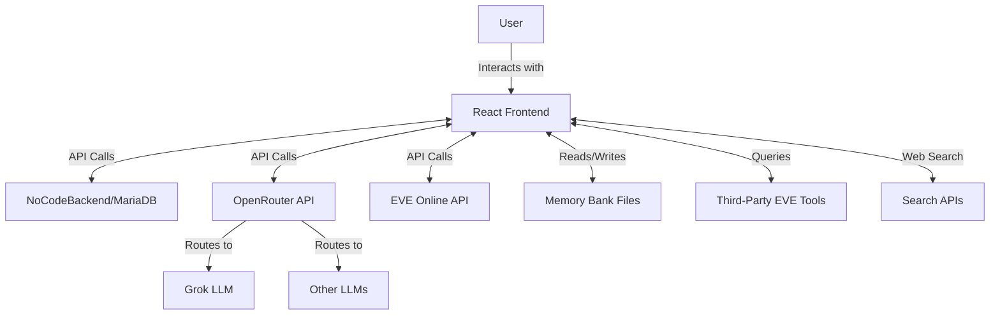
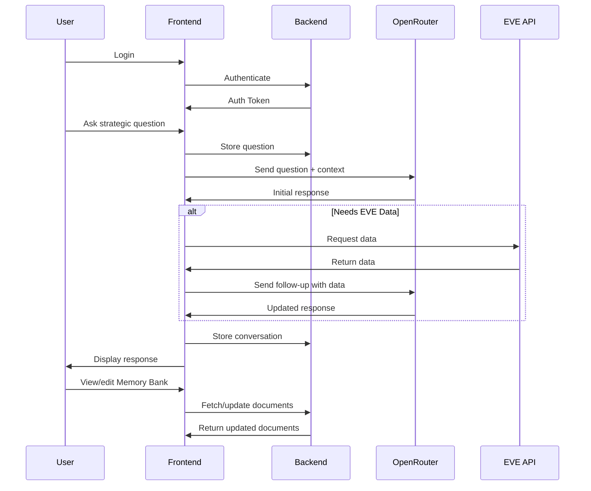

# Gryyk-47: EVE Online AI Assistant - Project Plan

Based on your requirements, I've created a comprehensive plan for building Gryyk-47, your EVE Online AI strategic assistant. This plan outlines the architecture, components, user flow, and development roadmap.

## System Architecture

## Component Breakdown

### 1. Frontend (React)
- **Chat Interface**: Modern, responsive design with message history
- **Memory Bank Viewer/Editor**: Interface to view and edit strategy documents
- **EVE Data Dashboard**: Display relevant EVE Online data from API
- **Settings Panel**: Configure LLM preferences, API keys, etc.

### 2. Backend (NoCodeBackend with MariaDB)
- **Chat History Storage**: Store all conversations
- **User Authentication**: Secure login for single user
- **Memory Bank Storage**: Database tables for strategy documents
- **API Integration Layer**: Connect to EVE Online API and third-party tools

### 3. AI Integration (OpenRouter)
- **LLM Selection**: Switch between Grok and other models
- **Context Management**: Maintain conversation context
- **Tool Usage**: Enable AI to use web search and EVE tools

### 4. EVE Online Integration
- **Authentication**: OAuth flow for EVE Online API
- **Data Retrieval**: Fetch character and corporation data
- **Third-Party Tool Integration**: Connect to community tools

## User Flow

## Development Roadmap

### Phase 1: Foundation (2-3 weeks)
1. Set up React project with basic UI components
2. Configure NoCodeBackend with initial schema
3. Implement basic chat functionality
4. Set up GitHub repository and Netlify deployment

### Phase 2: Core Features (3-4 weeks)
1. Integrate OpenRouter API for LLM access
2. Implement Memory Bank file structure
3. Create document viewer/editor
4. Set up authentication system

### Phase 3: EVE Integration (2-3 weeks)
1. Implement EVE Online API authentication
2. Create data fetching services
3. Build data visualization components
4. Test with real EVE data

### Phase 4: Advanced Features (3-4 weeks)
1. Implement web search capabilities
2. Add third-party EVE tool integrations
3. Enhance AI context management
4. Optimize performance and UX

### Phase 5: Testing & Deployment (1-2 weeks)
1. Build automated test scripts with Playwright
2. Comprehensive testing
3. Documentation
4. Final deployment to Netlify
5. Monitoring setup

## Technical Considerations

### Frontend
- **State Management**: Redux or Context API for global state
- **UI Framework**: Material UI or Chakra UI for modern components
- **API Client**: Axios for API requests
- **Chat UI**: Use a library like react-chat-elements

### Backend (NoCodeBackend)
- **Database Schema**:
  - Users table
  - Conversations table
  - Messages table
  - MemoryBank documents table
  - EVE data cache table

### Authentication
- JWT-based authentication for the application
- OAuth flow for EVE Online API access

### API Integrations
- OpenRouter API for LLM access
- EVE Online ESI (Eve Swagger Interface) for game data
- Search API (Google, Bing, or DuckDuckGo)

## Potential Challenges & Solutions

### Challenge 1: EVE API Complexity
**Solution**: Start with basic endpoints (character info, corporation details) and gradually expand. Use community libraries if available.

### Challenge 2: LLM Context Management
**Solution**: Implement efficient context windowing and document chunking to stay within token limits.

### Challenge 3: NoCodeBackend Limitations
**Solution**: Identify limitations early and plan architecture accordingly. Have fallback options for custom backend if needed.

### Challenge 4: Memory Bank File Management
**Solution**: Create a robust file structure with version control and backup mechanisms.

## Next Steps

1. Set up the initial React project structure
2. Create NoCodeBackend account and configure initial database
3. Design basic UI wireframes
4. Implement authentication flow
5. Set up GitHub repository and Netlify deployment
