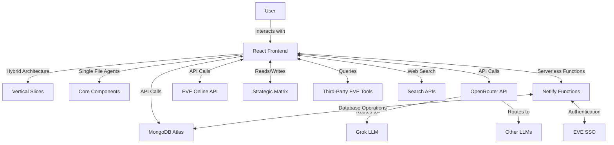
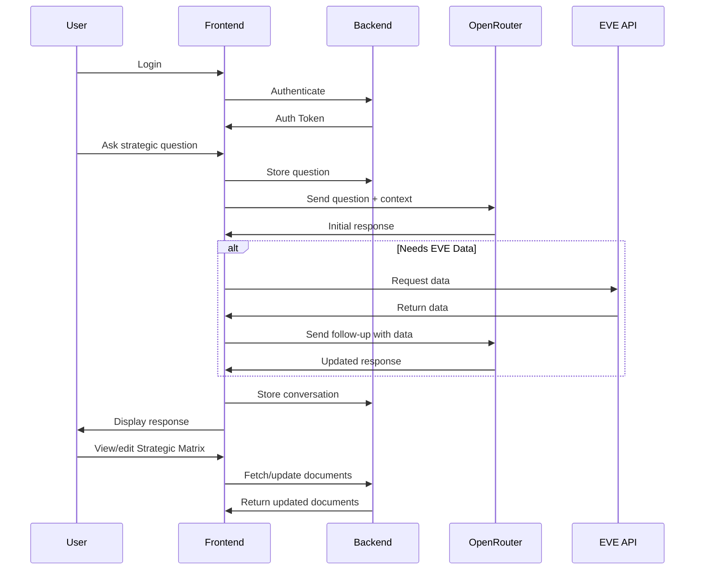

# Gryyk-47: EVE Online AI Assistant - Project Plan

This document outlines the current state and roadmap for Gryyk-47, an EVE Online AI strategic assistant. The project is currently in active development with core infrastructure implemented.

## System Architecture (Current Implementation)

## Component Breakdown (Current Implementation)

### 1. Frontend (React with Hybrid Architecture)
- **Chat Interface**: Modern, responsive design with message history
- **Strategic Matrix Panel**: Collapsible panel with document viewer/editor
- **EVE Data Dashboard**: Display relevant EVE Online data from API
- **Settings Panel**: Configure LLM preferences, API keys, etc.
- **Architecture**:
  - Vertical slice organization for features
  - Single file agent components
  - Zustand for state management
  - Chakra UI for components

### 2. Backend (MongoDB Atlas with Netlify Functions - Implemented)
- **Strategic Matrix Storage**: MongoDB collections for strategy documents
- **User Authentication**: EVE SSO with JWT token validation (implemented)
- **API Integration Layer**: Netlify serverless functions for:
  - Database operations (CRUD)
  - EVE API proxy
  - Third-party tool integration
- **Data Security**: Authentication middleware for database operations

### 3. AI Integration (OpenRouter - Implemented)
- **LLM Selection**: Grok as primary model with ability to switch
- **Context Management**: Custom implementation for conversation context
- **Tool Usage**: Web search and EVE tools integration planned

### 4. EVE Online Integration (Partial)
- **Authentication**: OAuth flow for EVE Online API (implemented)
- **Data Retrieval**: Services for character/corp data (in progress)
- **Third-Party Tool Integration**: Planned for Phase 4

## User Flow

## Development Roadmap (Updated)

### Phase 1: Foundation (85% Complete)
- [x] Set up React project with basic UI components
- [x] Configure MongoDB Atlas with initial schema
- [x] Implement base document storage functionality
- [x] Configure Netlify serverless functions
- [x] Set up GitHub repository and Netlify deployment
- [x] Migrate to hybrid architecture (vertical slices + single file agents)

### Phase 2: Core Features (90% Complete)
- [x] Integrate OpenRouter API for LLM access
- [x] Implement Strategic Matrix interface and file structure
- [x] Create document viewer/editor
- [x] Set up MongoDB Atlas integration with Netlify functions
- [x] Implement EVE Online SSO authentication
- [ ] Develop confidence assessment system (in progress)
- [ ] Finalize strategic workflows

### Phase 3: EVE Integration (40% Complete)
- [x] Implement EVE Online API authentication
- [ ] Create data fetching services for corporation/character data
- [ ] Build data visualization components
- [ ] Test with real EVE data
- [ ] Implement EVE-specific strategic considerations

### Phase 4: Advanced Features (Not Started)
1. Implement web search capabilities
2. Add third-party EVE tool integrations
3. Enhance AI context management
4. Optimize performance and UX
5. Implement Playwright for E2E testing

### Phase 5: Testing & Deployment (Not Started)
1. Comprehensive testing with real EVE scenarios
2. Complete user and developer documentation
3. Final deployment to Netlify
4. Monitoring setup
5. Performance optimization

## Technical Considerations (Updated)

### Frontend (Implemented)
- **State Management**: Zustand stores per feature
- **UI Framework**: Chakra UI components
- **API Client**: Axios for API requests
- **Architecture**: Hybrid vertical slice + single file agents
- **Testing**: Playwright for E2E testing

### Backend (MongoDB Atlas - Implemented)
- **Strategic Matrix Collections**:
  - corporation_context: History, leadership, values, vision
  - active_context: Current initiatives, recent decisions, immediate threats/opportunities
  - asset_information: Territory holdings, fleet composition, infrastructure
  - diplomatic_relations: Alliances, relationships, treaties, enemies
  - operational_details: PvP/PvE operations, industrial activities, logistics
  - threat_analysis: Hostile entities, market threats, vulnerabilities
  - opportunity_assessment: Potential expansions, economic opportunities
  
- **Supporting Collections**:
  - users: EVE character info and preferences
  - conversations: Chat history with AI
  - authentication_tokens: JWT tokens for sessions

- **Validation Rules**:
  - Markdown formatting for document content
  - Weekly update reminders
  - Document version history
  - Secure access controls via Netlify functions

### Authentication
- JWT-based authentication for the application
- OAuth flow for EVE Online API access

### API Integrations
- OpenRouter API for LLM access
- EVE Online ESI (Eve Swagger Interface) for game data
- Search API (Google, Bing, or DuckDuckGo)

## Potential Challenges & Solutions

### Challenge 1: EVE API Complexity
**Solution**: Start with basic endpoints (character info, corporation details) and gradually expand. Use community libraries if available.

### Challenge 2: LLM Context Management
**Solution**: Implement efficient context windowing and document chunking to stay within token limits.

### Challenge 3: MongoDB Atlas Integration
**Solution**: Implement secure serverless functions for database operations. Use authentication middleware and environment variables for credentials.

### Challenge 4: Strategic Matrix Data Management
**Solution**: Implement MongoDB collections with proper indexing and access controls. Use Netlify functions for secure data operations.

## Next Steps

1. Complete EVE data services implementation
2. Finalize confidence assessment system
3. Implement strategic workflows
4. Build data visualization components
5. Conduct comprehensive testing
6. Optimize performance for production
