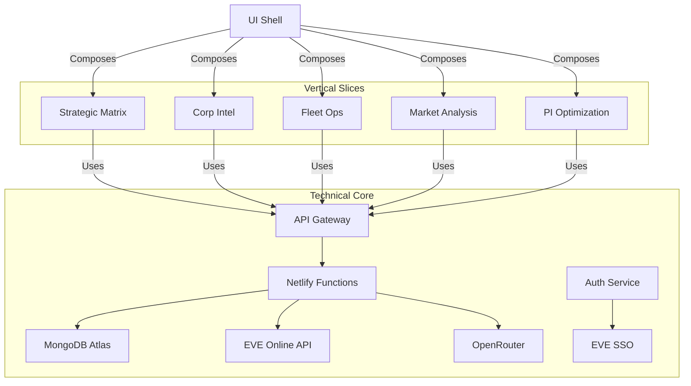
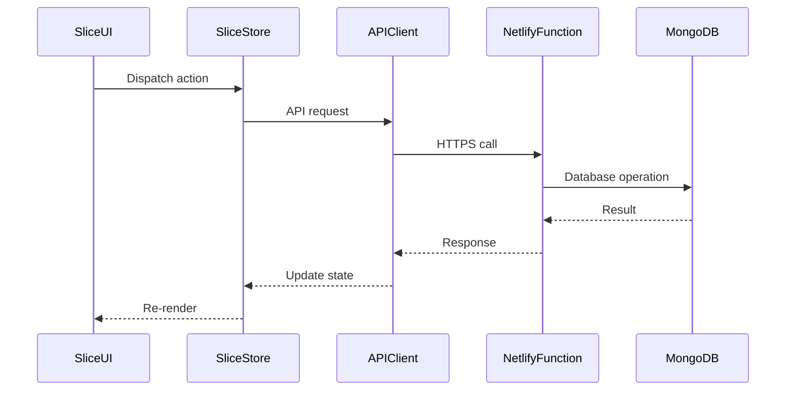

# Hybrid Vertical Slice Architecture Implementation

**Status: COMPLETE as of 2025-04-05**


## Architecture Overview



## Directory Structure

```
src/
├─ features/
│  ├─ strategic-matrix/      # Vertical slice
│  │  ├─ ui/                # Slice-specific components
│  │  ├─ state/             # Zustand store
│  │  ├─ api/               # Slice-specific API calls
│  │  └─ types.ts           # Type definitions
│  ├─ corp-intel/
│  ├─ fleet-ops/
├─ core/                     # Technical capabilities
│  ├─ api-client/           # Shared Axios instance
│  ├─ auth/                 # Authentication flows  
│  ├─ event-bus/            # Cross-slice communication
├─ pages/                   # Entry points
├─ components/              # Shared UI components
```

## Data Flow



## Implementation Steps

1. Refactor existing features into vertical slices
2. Create core technical capability modules
3. Implement event bus for cross-slice communication
4. Add slice-specific Zustand stores
5. Create API client wrapper with:
   - Automatic JWT injection
   - Error handling
   - Request/response logging
6. Update Netlify functions to handle slice-specific operations

## Key Decisions

1. Vertical slices own their UI, state, and API interactions
2. Core technical capabilities remain shared
3. Cross-slice communication via event bus
4. MongoDB collections map directly to vertical slices
5. Authentication handled at core level