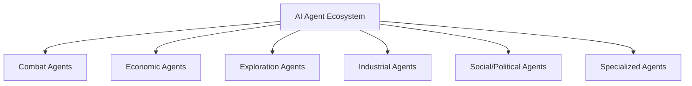

# EVE Online Activity AI Agents

## Activity Categories and Agent Specifications



### Combat Operations
- **Missions Agent**
  - Capabilities: NPC interaction, reward optimization
  - Training Data: Mission histories, NPC behavior patterns
  - Integration: Strategic matrix, corporation asset tracking

- **Faction Warfare Coordinator**
  - Capabilities: Territory analysis, reinforcement scheduling
  - Inputs: Sovereignty maps, fleet availability
  - Outputs: System priority lists, op timetables

### Economic Operations
- **Market Arbitrage Bot**
  - Features:
    - Real-time regional price monitoring
    - Margin calculation across 0.5-0.0 sec
    - Automated hauling contracts
  - Risk Parameters: Gank probability, jump fatigue

- **Industrial Planner**
  - Modules:
    - Blueprint analyzer
    - Material flow optimizer
    - Production queue manager
  - Integration: MongoDB Atlas, corp wallet

### Exploration Systems
- **Wormhole Mapper**
  - Capabilities:
    - Chain analysis
    - Site prioritization
    - Collapse prediction
  - Output: Dynamic WH topology maps

- **Relic Analyzer**
  - Functions:
    - Decryption protocols
    - Loot valuation
    - Security assessment
  - Integration: Corp logistics network

### Industrial Management
- **PI Optimizer**
  - Features:
    - Planetary layout designer
    - Routing efficiency calculator
    - Export scheduler
  - Training: EvePI template library

- **Haul Route Planner**
  - Inputs:
    - Cargo value
    - Security status
    - Corp jump bridge network
  - Output: Risk-adjusted routes

### Social/Political
- **Diplomacy Engine**
  - Capabilities:
    - Treaty analysis
    - Conflict prediction
    - Negotiation scripting
  - Integration: Alliance history database

- **Recruitment Assistant**
  - Features:
    - Player skill analysis
    - Corp culture matching
    - Security vetting
  - Data Sources: Killboards, employment history

## Implementation Roadmap

1. Phase 1: Core Agents (Missions, Market, PI)
2. Phase 2: Exploration & Logistics
3. Phase 3: Social/Political Systems
4. Phase 4: Cross-Agent Coordination Layer

```mermaid
gantt
    title AI Agent Deployment Timeline
    dateFormat YYYY-MM-DD
    section Core Agents
    Missions Agent      :2025-04-07, 14d
    Market Arbitrage    :2025-04-10, 21d
    PI Optimizer        :2025-04-14, 28d
    
    section Advanced Agents
    Wormhole Mapper    :2025-05-01, 35d
    Diplomacy Engine   :2025-05-15, 42d
    
    section Integration
    Cross-Agent API    :2025-06-01, 56d
