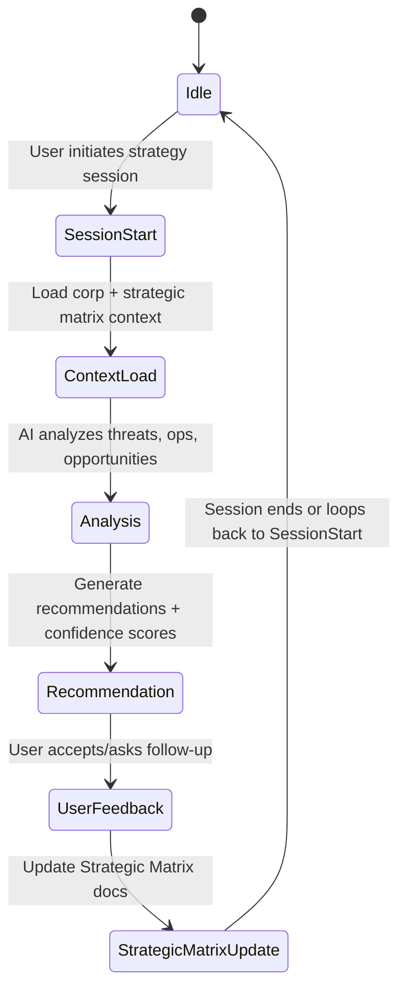

# Revised Plan: Enhance Gryyk-47 AI Strategic Workflows & Context Management

## Objectives
- Improve Gryyk-47's ability to manage, update, and utilize **corporation strategic context**
- Enable more coherent, context-aware, actionable strategic recommendations
- Establish clear workflows for strategic sessions, context updates, and decision support
- **Ensure only the Strategic Matrix (corporation knowledge) is updated during sessions**

---

## 1. Strategic Session Lifecycle

**Note:**  
- **No updates to development Memory Bank occur during this workflow.**  
- Only the **Strategic Matrix** (corporation operational knowledge) is modified.

---

## 2. Context Management Enhancements

- **Context Layers:**
  - **Static Context:** Corp history, assets, diplomatic relations
  - **Active Context:** Current ops, recent decisions, threats/opportunities
  - **Session Context:** User queries, AI analysis, recommendations

- **Context Sources:**
  - Strategic Matrix documents (MongoDB)
  - EVE Online API data
  - User inputs during chat
  - AI-generated insights

- **Update Triggers:**
  - After each strategic session
  - When new EVE data is fetched
  - On explicit user commands (e.g., "update corp assets")

---

## 3. Workflow Implementation Steps

### a) Session Initialization
- Load Strategic Matrix docs
- Fetch latest EVE API data
- Summarize corp strategic context for AI prompt

### b) AI Prompt Engineering
- Construct prompts with:
  - Corp profile
  - Active initiatives
  - Recent changes
  - Known threats/opportunities
  - User's current query

### c) Recommendation Generation
- Use OpenRouter (Grok) to:
  - Analyze context
  - Generate strategic options
  - Provide confidence scores
  - Suggest next actions

### d) User Interaction
- Present recommendations + confidence
- User can accept, reject, or request more detail

### e) Strategic Matrix Update
- Log accepted decisions
- Update relevant Strategic Matrix docs
- Adjust active corp context accordingly

---

## 4. Technical Tasks

| Task | Description | Priority |
|-------|-------------|----------|
| **Design corp context schemas** | JSON schemas for static, active, session corp data | High |
| **Enhance prompt builder** | Assemble AI prompts from corp context layers | High |
| **Session state management** | Track session lifecycle in frontend (Zustand) | High |
| **Strategic Matrix update API** | Serverless functions to update corp docs | Medium |
| **Confidence scoring** | Integrate into AI responses | Medium |
| **UI improvements** | Display corp context, recommendations, confidence | Medium |
| **Logging & feedback** | Log user feedback and AI decisions | Low |

---

## 5. Dependencies & Considerations

- **EVE API integration**: For real-time corp data
- **MongoDB schema updates**: For layered corp context
- **Prompt size limits**: Optimize for LLM context window
- **Security**: Protect sensitive corp data
- **Testing**: Simulate sessions with mock corp data

---

## 6. Deliverables

- Updated corp context schemas
- Enhanced AI prompt builder
- Session lifecycle management
- Improved strategic session UI
- API endpoints for Strategic Matrix updates
- Documentation of workflows

---

This plan ensures **only the Strategic Matrix (corporation knowledge)** is updated during AI-assisted gameplay sessions, **not** the development Memory Bank.