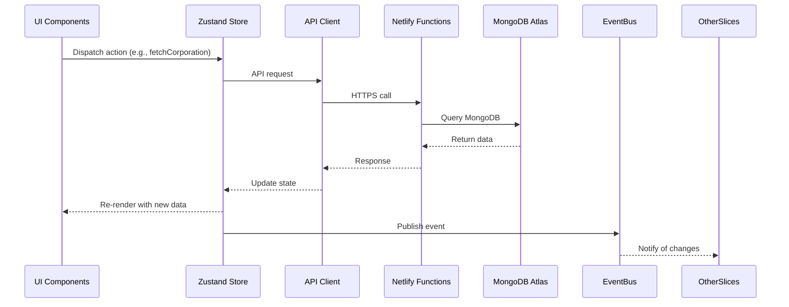

# Gryyk-47 Strategic Context Frontend Implementation

This document outlines the frontend implementation for managing Strategic Context data in the Gryyk-47 application, focusing on Zustand stores, data fetching, and UI components.

## Zustand Store Structure

The Strategic Context data will be managed through a set of Zustand stores, following the hybrid vertical slice architecture pattern.

### Store Organization

```
src/
├─ features/
│  ├─ strategic-context/
│  │  ├─ store.ts         # Main store for strategic context
│  │  ├─ types.ts         # TypeScript interfaces
│  │  ├─ api.ts           # API interaction functions
│  │  ├─ ui/              # UI components
│  │  └─ index.ts         # Public API
```

### Core Store Implementation

```typescript
// src/features/strategic-context/store.ts
import { create } from 'zustand';
import { immer } from 'zustand/middleware/immer';
import * as api from './api';
import {
  CorporationContext,
  ActiveContext,
  AssetInformation,
  DiplomaticRelations,
  OperationalDetails,
  ThreatAnalysis,
  OpportunityAssessment,
  SessionContext
} from '../../models/strategicContextModels';

interface StrategicContextState {
  // Data
  corporation: CorporationContext | null;
  activeContext: ActiveContext | null;
  assets: AssetInformation | null;
  diplomacy: DiplomaticRelations | null;
  operations: OperationalDetails | null;
  threats: ThreatAnalysis | null;
  opportunities: OpportunityAssessment | null;
  sessions: SessionContext[];
  activeSession: SessionContext | null;
  
  // Loading states
  loading: {
    corporation: boolean;
    activeContext: boolean;
    assets: boolean;
    diplomacy: boolean;
    operations: boolean;
    threats: boolean;
    opportunities: boolean;
    sessions: boolean;
  };
  
  // Error states
  errors: {
    corporation: string | null;
    activeContext: string | null;
    assets: string | null;
    diplomacy: string | null;
    operations: string | null;
    threats: string | null;
    opportunities: string | null;
    sessions: string | null;
  };
  
  // Actions
  fetchCorporation: () => Promise<void>;
  updateCorporation: (data: Partial<CorporationContext>) => Promise<void>;
  
  fetchActiveContext: () => Promise<void>;
  createActiveContext: (data: Partial<ActiveContext>) => Promise<void>;
  
  fetchAssets: () => Promise<void>;
  updateAssets: (data: Partial<AssetInformation>) => Promise<void>;
  
  fetchDiplomacy: () => Promise<void>;
  updateDiplomacy: (data: Partial<DiplomaticRelations>) => Promise<void>;
  
  fetchOperations: () => Promise<void>;
  updateOperations: (data: Partial<OperationalDetails>) => Promise<void>;
  
  fetchThreats: () => Promise<void>;
  updateThreats: (data: Partial<ThreatAnalysis>) => Promise<void>;
  
  fetchOpportunities: () => Promise<void>;
  updateOpportunities: (data: Partial<OpportunityAssessment>) => Promise<void>;
  
  fetchSessions: () => Promise<void>;
  startSession: () => Promise<void>;
  updateSession: (sessionId: string, data: Partial<SessionContext>) => Promise<void>;
  
  // Utility functions
  getFullContext: () => StrategicContextSummary;
}

export const useStrategicContextStore = create<StrategicContextState>()(
  immer((set, get) => ({
    // Initial state
    corporation: null,
    activeContext: null,
    assets: null,
    diplomacy: null,
    operations: null,
    threats: null,
    opportunities: null,
    sessions: [],
    activeSession: null,
    
    loading: {
      corporation: false,
      activeContext: false,
      assets: false,
      diplomacy: false,
      operations: false,
      threats: false,
      opportunities: false,
      sessions: false,
    },
    
    errors: {
      corporation: null,
      activeContext: null,
      assets: null,
      diplomacy: null,
      operations: null,
      threats: null,
      opportunities: null,
      sessions: null,
    },
    
    // Actions
    fetchCorporation: async () => {
      set(state => { state.loading.corporation = true; state.errors.corporation = null; });
      try {
        const data = await api.fetchCorporation();
        set(state => { state.corporation = data; });
      } catch (error) {
        set(state => { state.errors.corporation = error.message; });
      } finally {
        set(state => { state.loading.corporation = false; });
      }
    },
    
    updateCorporation: async (data) => {
      set(state => { state.loading.corporation = true; state.errors.corporation = null; });
      try {
        const updatedData = await api.updateCorporation(data);
        set(state => { state.corporation = updatedData; });
      } catch (error) {
        set(state => { state.errors.corporation = error.message; });
      } finally {
        set(state => { state.loading.corporation = false; });
      }
    },
    
    // Similar implementations for other entities...
    
    // Utility function to get full context for AI prompts
    getFullContext: () => {
      const state = get();
      return {
        corporation: state.corporation,
        activeContext: state.activeContext,
        assets: state.assets,
        diplomacy: state.diplomacy,
        operations: state.operations,
        threats: state.threats,
        opportunities: state.opportunities
      };
    }
  }))
);
```

### API Integration

```typescript
// src/features/strategic-context/api.ts
import { apiClient } from '../../core/api-client';
import {
  CorporationContext,
  ActiveContext,
  AssetInformation,
  DiplomaticRelations,
  OperationalDetails,
  ThreatAnalysis,
  OpportunityAssessment,
  SessionContext
} from '../../models/strategicContextModels';

// Corporation Context
export const fetchCorporation = async (): Promise<CorporationContext> => {
  const response = await apiClient.get('/.netlify/functions/strategic-context/corporation');
  return response.data;
};

export const updateCorporation = async (data: Partial<CorporationContext>): Promise<CorporationContext> => {
  const response = await apiClient.post('/.netlify/functions/strategic-context/corporation', data);
  return response.data;
};

// Active Context
export const fetchActiveContext = async (): Promise<ActiveContext> => {
  const response = await apiClient.get('/.netlify/functions/strategic-context/active');
  return response.data;
};

export const createActiveContext = async (data: Partial<ActiveContext>): Promise<ActiveContext> => {
  const response = await apiClient.post('/.netlify/functions/strategic-context/active', data);
  return response.data;
};

// Similar implementations for other entities...
```

### Public API

```typescript
// src/features/strategic-context/index.ts
export { useStrategicContextStore } from './store';
export * from './types';
export * from './ui';
```

## UI Components

### Strategic Matrix Panel

```typescript
// src/features/strategic-context/ui/StrategicMatrixPanel.tsx
import React, { useEffect } from 'react';
import { Box, VStack, Heading, Text, Spinner, Accordion } from '@chakra-ui/react';
import { useStrategicContextStore } from '../store';

export const StrategicMatrixPanel: React.FC = () => {
  const {
    corporation,
    activeContext,
    assets,
    diplomacy,
    operations,
    threats,
    opportunities,
    loading,
    fetchCorporation,
    fetchActiveContext,
    fetchAssets,
    fetchDiplomacy,
    fetchOperations,
    fetchThreats,
    fetchOpportunities
  } = useStrategicContextStore();

  useEffect(() => {
    // Fetch all data on component mount
    fetchCorporation();
    fetchActiveContext();
    fetchAssets();
    fetchDiplomacy();
    fetchOperations();
    fetchThreats();
    fetchOpportunities();
  }, []);

  const isLoading = Object.values(loading).some(Boolean);

  if (isLoading) {
    return (
      <Box p={4} borderLeft="1px" borderColor="gray.200" height="100vh">
        <VStack spacing={4} align="center" justify="center" height="100%">
          <Spinner size="xl" />
          <Text>Loading strategic context...</Text>
        </VStack>
      </Box>
    );
  }

  return (
    <Box p={4} borderLeft="1px" borderColor="gray.200" height="100vh" overflowY="auto">
      <VStack spacing={4} align="stretch">
        <Heading size="md">Strategic Matrix</Heading>
        
        <Accordion allowMultiple defaultIndex={[0]}>
          {/* Corporation Context */}
          <AccordionItem>
            <AccordionButton>
              <Box flex="1" textAlign="left">
                <Heading size="sm">Corporation</Heading>
              </Box>
              <AccordionIcon />
            </AccordionButton>
            <AccordionPanel pb={4}>
              {corporation ? (
                <VStack align="stretch" spacing={2}>
                  <Text><strong>Name:</strong> {corporation.name}</Text>
                  <Text><strong>Ticker:</strong> {corporation.ticker}</Text>
                  {corporation.description && (
                    <Text><strong>Description:</strong> {corporation.description}</Text>
                  )}
                </VStack>
              ) : (
                <Text>No corporation data available</Text>
              )}
            </AccordionPanel>
          </AccordionItem>
          
          {/* Similar accordion items for other context categories */}
        </Accordion>
      </VStack>
    </Box>
  );
};
```

### Session Management

```typescript
// src/features/strategic-context/ui/SessionManager.tsx
import React, { useState } from 'react';
import { Box, Button, VStack, Text, Heading } from '@chakra-ui/react';
import { useStrategicContextStore } from '../store';

export const SessionManager: React.FC = () => {
  const { activeSession, startSession, updateSession } = useStrategicContextStore();
  const [userInput, setUserInput] = useState('');

  const handleStartSession = () => {
    startSession();
  };

  const handleSubmitQuery = () => {
    if (!activeSession || !userInput.trim()) return;
    
    // Add user query to session
    const updatedQueries = [...(activeSession.userQueries || []), userInput];
    updateSession(activeSession.sessionId, { userQueries: updatedQueries });
    
    // Clear input
    setUserInput('');
    
    // In a real implementation, this would trigger the AI processing
  };

  return (
    <Box p={4}>
      <VStack spacing={4} align="stretch">
        <Heading size="md">Strategic Session</Heading>
        
        {!activeSession ? (
          <Button colorScheme="blue" onClick={handleStartSession}>
            Start New Strategic Session
          </Button>
        ) : (
          <VStack spacing={4} align="stretch">
            <Text>Session ID: {activeSession.sessionId}</Text>
            <Text>Started: {new Date(activeSession.startTime).toLocaleString()}</Text>
            
            {/* Chat-like interface for queries and responses */}
            <Box borderWidth="1px" borderRadius="md" p={4} maxHeight="400px" overflowY="auto">
              {activeSession.userQueries?.map((query, index) => (
                <Box key={index} mb={4}>
                  <Text fontWeight="bold">You:</Text>
                  <Text>{query}</Text>
                  
                  {activeSession.aiAnalysis?.[index] && (
                    <>
                      <Text fontWeight="bold" mt={2}>Gryyk-47:</Text>
                      <Text>{activeSession.aiAnalysis[index]}</Text>
                    </>
                  )}
                </Box>
              ))}
            </Box>
            
            {/* Input for new queries */}
            <Box>
              <Textarea
                value={userInput}
                onChange={(e) => setUserInput(e.target.value)}
                placeholder="Ask Gryyk-47 for strategic advice..."
                resize="vertical"
              />
              <Button
                mt={2}
                colorScheme="blue"
                onClick={handleSubmitQuery}
                isDisabled={!userInput.trim()}
              >
                Submit
              </Button>
            </Box>
          </VStack>
        )}
      </VStack>
    </Box>
  );
};
```

## Integration with Event Bus

To support cross-slice communication, the Strategic Context store will publish events when significant changes occur:

```typescript
// src/features/strategic-context/store.ts
import { eventBus } from '../../core/event-bus';

// Inside the store actions:
updateCorporation: async (data) => {
  set(state => { state.loading.corporation = true; state.errors.corporation = null; });
  try {
    const updatedData = await api.updateCorporation(data);
    set(state => { state.corporation = updatedData; });
    
    // Publish event for other slices
    eventBus.publish('strategicContext:corporationUpdated', updatedData);
  } catch (error) {
    set(state => { state.errors.corporation = error.message; });
  } finally {
    set(state => { state.loading.corporation = false; });
  }
},
```

## Data Flow Diagram



## Implementation Steps

1. Create the TypeScript interfaces (already done in `strategicContextModels.ts`)
2. Implement the Zustand store with immer middleware
3. Create API interaction functions
4. Build UI components for displaying and editing strategic context
5. Integrate with the event bus for cross-slice communication
6. Connect to the chat interface for AI strategic sessions