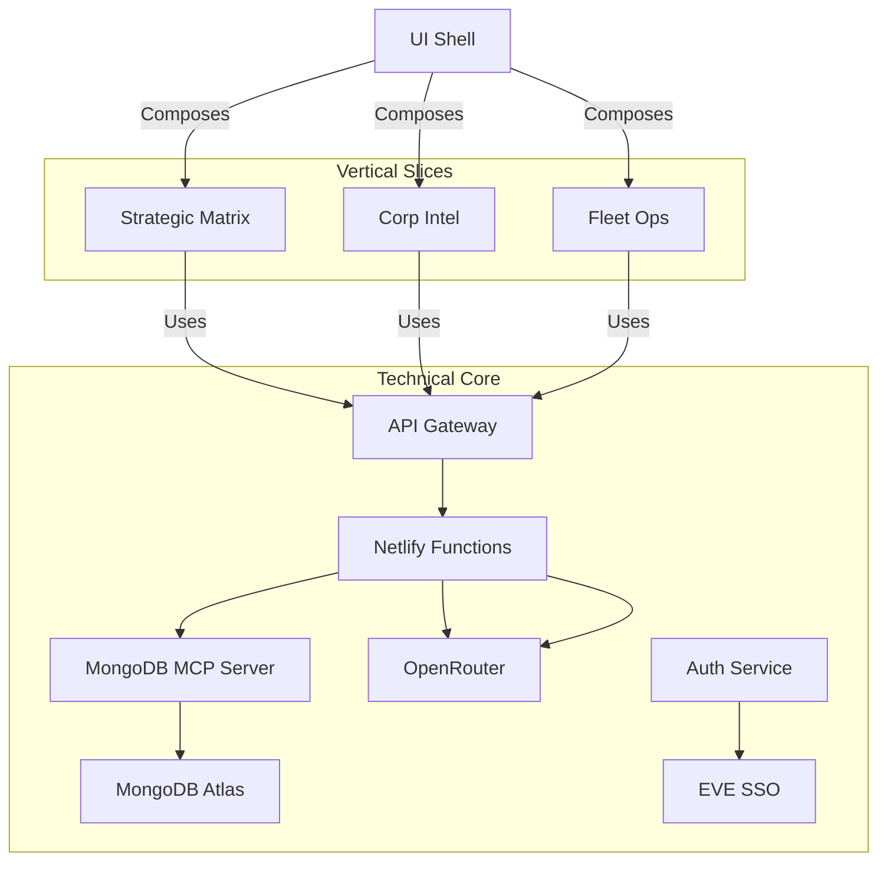

# Active Context: Gryyk-47 EVE Online AI Assistant

## Documentation Systems

- **Memory Bank** (Development Documentation):
  - Location: `project/cline_docs/`
  - Purpose: Tracks architecture decisions and development progress
  - Maintained by: Development team and AI assistant
  - Content Examples: Technical specs, implementation plans, progress tracking

- **Strategic Matrix** (Game Documentation):
  - Location: Application database and EVE Online integrations
  - Purpose: Maintains corporation operational knowledge and strategy
  - Maintained by: Corporation leadership and gameplay AI assistant
  - Content Examples: Assets, diplomatic relations, operational plans, threat analysis

Key Differences:
1. Memory Bank is outward-facing (development process)
2. Strategic Matrix is inward-facing (corporation operations)

## What We're Working On Now

We are currently:
1. Implementing the hybrid vertical slice architecture
2. Refactoring features into vertical slices with clear boundaries
3. Establishing core technical capabilities layer
4. Implementing cross-slice communication via event bus
5. Updating documentation to reflect architectural changes
<<<<<<< HEAD
=======
6. Integrating Vercel AI SDK for LLM orchestration and context management
7. Implementing improved MongoDB data model for persistent chat and context
>>>>>>> 1ed7324 (Initial commit)

## Recent Changes

- Implemented strategic-matrix Zustand store:
  - Type-safe state management
  - CRUD operations for documents
  - Loading/error states
  - Immer integration for immutable updates

- Implemented event bus system for cross-slice communication:
  - Publish/subscribe pattern
  - Type-safe event handling
  - Subscription management
  - Debug logging

- Implemented core API client for hybrid vertical slice architecture:
  - JWT token injection
  - Comprehensive error handling
  - Request/response logging
  - Proper TypeScript typing
  - Singleton pattern for shared instance

- Implemented auth module for token management:
  - getAuthToken() function
  - isAuthenticated() check
  - Integration with existing auth store

- Updated hybrid vertical slice architecture:
  - Features organized as vertical slices (strategic-matrix, corp-intel, fleet-ops)
  - Core technical capabilities (api-client, auth, event-bus)
  - Clear slice boundaries with public APIs
- Documented architecture in HybridVerticalSliceArchitecture.md
- Updated technical documentation:
  - techContext.md with new architecture
  - systemPatterns.md with hybrid patterns
- Created initial project plan document (Gryyk-47-Project-Plan.md)
- Established memory bank file structure in cline_docs/
- Defined system architecture and component breakdown
- Outlined development roadmap with estimated timelines
- Identified potential challenges and solutions
- Added MongoDB MCP server integration (F:/Cline/MCP/mongodb-server) connecting to local MongoDB instance
- Added Gryyk-47 AI Strategic Workflow Plan (`gryyk47_strategic_workflow_plan.md`)
- Added Gryyk-47 AI Strategic Workflow Implementation Plan (`gryyk47_strategic_workflow_implementation.md`)
- Implemented MongoDB Atlas integration:
  - Created MongoDB Atlas cluster for data storage
  - Defined JSON schemas for all Strategic Matrix collections
  - Created TypeScript interfaces in `src/models/strategicContextModels.ts`
  - Set up collections and indexes in MongoDB Atlas
  - Documented API endpoints for Strategic Context data
  - Designed Zustand store structure for frontend data management
- Implemented EVE SSO OAuth2 integration:
  - Functions `exchangeAuthCode` and `getCharacterInfo`
  - Handles authorization code exchange and character info retrieval
- Created `auth-verify` Netlify Function to proxy token verification server-side, avoiding CORS issues
- Updated frontend to use serverless function for token verification
- Fixed token extraction and validation bugs in OAuth callback
- Added debug logging for token exchange and refresh flows
- Diagnosed persistent login loop likely caused by invalid or expired tokens
- Confirmed Netlify functions for MongoDB do not interfere with OAuth flow
- Fixed authentication issues with Netlify functions:
  - Added proper CORS headers to handle preflight requests
  - Configured redirects from `/api/auth-verify` to `/.netlify/functions/auth-verify`
  - Improved error handling and logging in serverless functions
  - Added fallback to direct EVE SSO API calls when Netlify functions fail
  - Updated EVE SSO verify endpoint URL to use ESI API (https://esi.evetech.net/verify/)
- Implemented proper Netlify functions deployment configuration:
  - Created custom build script to handle TypeScript functions
  - Updated package.json with proper build commands
  - Configured tsconfig.functions.json for serverless functions
  - Updated netlify.toml to use the functions-dist directory
  - Added fallback mechanisms in frontend code for robustness

<<<<<<< HEAD
=======
**NEW:**
- Fixed EVE SSO "Invalid state parameter" error by implementing secure state parameter generation, storage, and validation (see `src/services/ssoState.ts` and `eve_sso_state_handling_example.md`).
- Created and documented a robust MongoDB data model implementation plan for persistent chat, message metadata, and LLM context retrieval.
- Installed and prepared to integrate the Vercel AI SDK for advanced LLM orchestration and context management.
- **Jitaspace project (TypeScript/React/ESI monorepo) downloaded and installed at `G:\Development Projects\Eve AI\jitaspace\jitaspace`.**
  - Contains reusable ESI clients, hooks, UI, and metadata packages.
  - Next step: Analyze jitaspace packages for integration into Gryyk-47 (focus: ESI, hooks, UI, metadata).
- **Jitaspace ESI Client Analysis (2025-04-13):**
  - The `esi-client` package provides a comprehensive, auto-generated, modular ESI API client for EVE Online.
  - Exposes hundreds of ESI endpoints as individual modules, with TypeScript types, React hooks, and Zod schemas for type safety and validation.
  - Enables direct, type-safe access to EVE Online data and operations for Gryyk-47's vertical slices and agent-based features.
  - Highly suitable for AI agent workflows by topic (e.g., assets, corp info, market, fleet, etc.).
  - Next: Select endpoints and hooks for strategic workflows and plan integration into the vertical slice architecture.
- **Agent-Oriented Architecture (2025-04-13):**
  - Evaluating Google's Agent Development Kit and agent2agent protocol for orchestrating multi-agent, multi-system workflows.
  - Considering integration with Model Context Protocol (MCP) for agent interoperability and context sharing.
  - See: https://cloud.google.com/blog/products/ai-machine-learning/build-and-manage-multi-system-agents-with-vertex-ai
  - Potential to enable advanced agent-based features, distributed reasoning, and cross-system collaboration in Gryyk-47.
>>>>>>> 1ed7324 (Initial commit)

## Architecture Implementation

## Next Steps

1. **Architecture Refinement**:
   - Complete vertical slice refactoring
   - Implement event bus for cross-slice communication
   - Finalize core technical capabilities

2. **Core Features**:
   - Enhance strategic workflows
<<<<<<< HEAD
   - Improve AI context management
=======
   - Improve AI context management (with Vercel AI SDK)
>>>>>>> 1ed7324 (Initial commit)
   - Optimize performance

3. **EVE Integration**:
   - Complete data services implementation
   - Build visualization components
   - Test with real EVE data

4. **Advanced Features**:
   - Implement web search capabilities
   - Add third-party tool integrations
   - Develop confidence assessment system

5. **Testing & Deployment**:
   - Build automated test scripts
   - Conduct comprehensive testing
   - Finalize deployment setup
