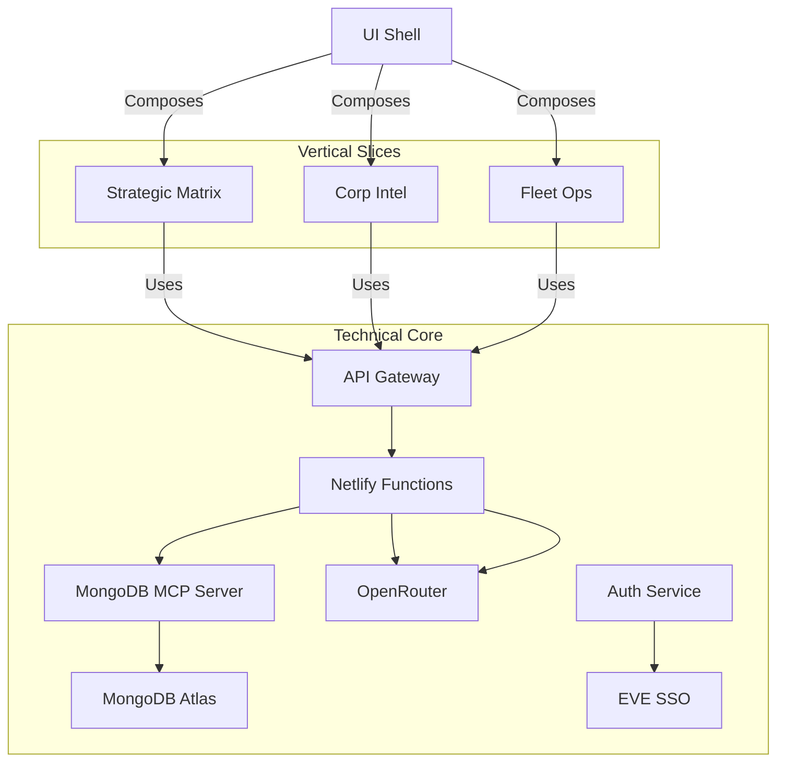

# Active Context: Gryyk-47 EVE Online AI Assistant

## Documentation Systems

- **Memory Bank** (Development Documentation):
  - Location: `project/cline_docs/`
  - Purpose: Tracks architecture decisions and development progress
  - Maintained by: Development team and AI assistant
  - Content Examples: Technical specs, implementation plans, progress tracking

- **Strategic Matrix** (Game Documentation):
  - Location: Application database and EVE Online integrations
  - Purpose: Maintains corporation operational knowledge and strategy
  - Maintained by: Corporation leadership and gameplay AI assistant
  - Content Examples: Assets, diplomatic relations, operational plans, threat analysis

Key Differences:
1. Memory Bank is outward-facing (development process)
2. Strategic Matrix is inward-facing (corporation operations)

## What We're Working On Now

We are currently:
1. Implementing the hybrid vertical slice architecture
2. Refactoring features into vertical slices with clear boundaries
3. Establishing core technical capabilities layer
4. Implementing cross-slice communication via event bus
5. Updating documentation to reflect architectural changes

## Recent Changes

- Implemented strategic-matrix Zustand store:
  - Type-safe state management
  - CRUD operations for documents
  - Loading/error states
  - Immer integration for immutable updates

- Implemented event bus system for cross-slice communication:
  - Publish/subscribe pattern
  - Type-safe event handling
  - Subscription management
  - Debug logging

- Implemented core API client for hybrid vertical slice architecture:
  - JWT token injection
  - Comprehensive error handling
  - Request/response logging
  - Proper TypeScript typing
  - Singleton pattern for shared instance

- Implemented auth module for token management:
  - getAuthToken() function
  - isAuthenticated() check
  - Integration with existing auth store

- Updated hybrid vertical slice architecture:
  - Features organized as vertical slices (strategic-matrix, corp-intel, fleet-ops)
  - Core technical capabilities (api-client, auth, event-bus)
  - Clear slice boundaries with public APIs
- Documented architecture in HybridVerticalSliceArchitecture.md
- Updated technical documentation:
  - techContext.md with new architecture
  - systemPatterns.md with hybrid patterns
- Created initial project plan document (Gryyk-47-Project-Plan.md)
- Established memory bank file structure in cline_docs/
- Defined system architecture and component breakdown
- Outlined development roadmap with estimated timelines
- Identified potential challenges and solutions
- Added MongoDB MCP server integration (F:/Cline/MCP/mongodb-server) connecting to local MongoDB instance

## Architecture Implementation

```mermaid
graph TD
    subgraph Technical Core
        A[API Gateway] --> B[Netlify Functions]
        B --> C[MongoDB MCP Server]
        C --> D[MongoDB Atlas]
        B --> E[EVE Online API]
        B --> E[OpenRouter]
        F[Auth Service] --> G[EVE SSO]
    end

    subgraph Vertical Slices
        H[Strategic Matrix] --> |Uses| A
        I[Corp Intel] --> |Uses| A
        J[Fleet Ops] --> |Uses| A
    end

    M[UI Shell] --> |Composes| H
    M --> |Composes| I
    M --> |Composes| J
```

## Next Steps

1. **Architecture Refinement**:
   - Complete vertical slice refactoring
   - Implement event bus for cross-slice communication
   - Finalize core technical capabilities

2. **Core Features**:
   - Enhance strategic workflows
   - Improve AI context management
   - Optimize performance

3. **EVE Integration**:
   - Complete data services implementation
   - Build visualization components
   - Test with real EVE data

4. **Advanced Features**:
   - Implement web search capabilities
   - Add third-party tool integrations
   - Develop confidence assessment system

5. **Testing & Deployment**:
   - Build automated test scripts
   - Conduct comprehensive testing
   - Finalize deployment setup
