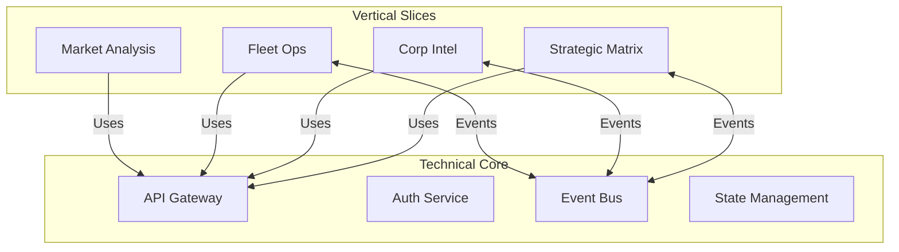
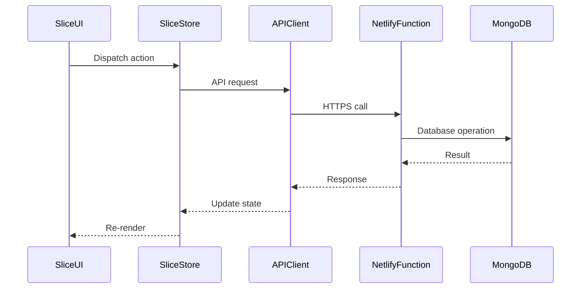

# System Patterns: Gryyk-47 EVE Online AI Assistant

## Architecture Overview

Gryyk-47 follows a hybrid vertical slice architecture combining:
1. Feature isolation through vertical slices
2. Shared technical capabilities in core layer
3. Clear cross-slice communication patterns



## Key Architectural Patterns

### 1. Vertical Slice Organization
- **Structure**:
  - Each feature has complete ownership of:
    - UI components
    - State management
    - API interactions
    - Type definitions
  - Exposes clean public API via index.ts
- **Benefits**:
  - Strong feature boundaries
  - Reduced cross-feature dependencies
  - Easier testing and maintenance

### 2. Core Technical Layer
- **Components**:
  - API client with interceptors
  - Authentication flows
  - Event bus system
  - Shared utilities
- **Implementation**:
  - Singleton patterns for shared services
  - Dependency injection for testability
  - Well-defined interfaces

### 3. Cross-Slice Communication
- **Patterns**:
  - Event bus for loose coupling
  - Shared state for coordinated UI
  - API composition for data aggregation
- **Guidelines**:
  - Prefer events over direct calls
  - Use well-defined event contracts
  - Limit shared state surface area

## Implementation Guidelines

### Directory Structure
```
src/
├─ features/            # Vertical slices
│  ├─ strategic-matrix/
│  │  ├─ ui/           # Slice-specific components
│  │  ├─ state/        # Zustand store
│  │  ├─ api/          # API interactions
│  │  └─ index.ts      # Public API
├─ core/               # Technical capabilities
│  ├─ api-client/     
│  ├─ auth/           
│  ├─ event-bus/      
├─ components/         # Shared UI components
```

### Data Flow


## Benefits & Tradeoffs

### Benefits
- Clear feature boundaries
- Improved team autonomy
- Better test isolation
- Gradual adoption path

### Tradeoffs
- Some duplication across slices
- Requires discipline in cross-slice communication
- Initial setup complexity
