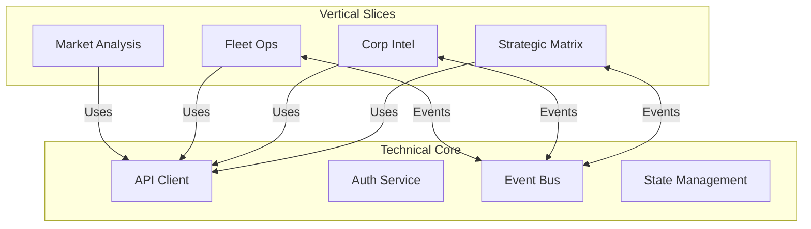

# Technical Context: Gryyk-47 EVE Online AI Assistant

## Architecture Implementation

### Hybrid Vertical Slice Architecture

```mermaid
graph TD
    subgraph Technical Core
        A[API Client]
        B[Auth Service]
        C[Event Bus]
        D[State Management]
    end

    subgraph Vertical Slices
        E[Strategic Matrix]
        F[Corp Intel]
        G[Fleet Ops]
        H[Market Analysis]
    end

    E --> |Uses| A
    F --> |Uses| A
    G --> |Uses| A
    H --> |Uses| A
    
    E <--> |Events| C
    F <--> |Events| C
    G <--> |Events| C
```

## Technologies Used

### Frontend
- **React**: JavaScript library for building the user interface
- **State Management**: Zustand stores per vertical slice with:
  - Type-safe state definitions
  - Immer integration for immutable updates
  - Slice-specific business logic
  - API integration
  - Loading/error state handling
- **UI Framework**: Chakra UI components
- **API Client**: Robust Axios implementation with:
  - Automatic JWT injection
  - Request/response interceptors
  - Comprehensive error handling
  - TypeScript support
  - Request/response logging
- **Architecture**: Hybrid vertical slice pattern
- **Markdown**: react-markdown for document rendering

### Core Technical Layer
- **Event Bus**:
  - Publish/subscribe pattern
  - Type-safe event handling
  - Subscription management
  - Debug logging
  - Support for cross-slice communication

### Backend
- **MongoDB Atlas**: Cloud database for document storage
- **Netlify Functions**: Serverless functions for backend operations
- **Authentication**: JWT via EVE Online SSO
- **Document Storage**: MongoDB collections per vertical slice
- **MongoDB MCP Server**: Local MCP server at F:/Cline/MCP/mongodb-server connecting to mongodb://localhost:27017

### AI Integration
- **OpenRouter**: API for language model access
- **Default LLM**: Grok
- **Context Management**: Custom implementation
- **Confidence Assessment**: Strategic recommendation scoring

## Development Setup

### Project Structure
```
src/
├─ features/            # Vertical slices
│  ├─ strategic-matrix/
│  │  ├─ ui/           # Slice components
│  │  ├─ state/        # Zustand store
│  │  ├─ api/          # API interactions
│  │  └─ index.ts      # Public API
├─ core/               # Technical capabilities
│  ├─ api-client/      # Core API client with JWT injection and error handling
│  ├─ auth/            # Authentication flows
│  ├─ event-bus/       # Cross-slice communication
├─ components/         # Shared UI components
```

### Build Process
1. Local development with `npm start`
2. GitHub Actions for CI/CD
3. Netlify deployment with:
   - Environment variables
   - Serverless functions
   - MongoDB Atlas integration

## Technical Constraints

### Performance
- UI response: <500ms
- API latency: <1s
- Memory: <100MB client-side
- Concurrent users: 100+

### Security
- EVE Online SSO authentication
- Role-based access control
- Encrypted sensitive data
- Rate limited APIs

### Compatibility
- Modern browsers (Chrome, Firefox, Safari, Edge)
- Desktop and tablet
- Minimum 768px width
- WCAG 2.1 AA compliance
